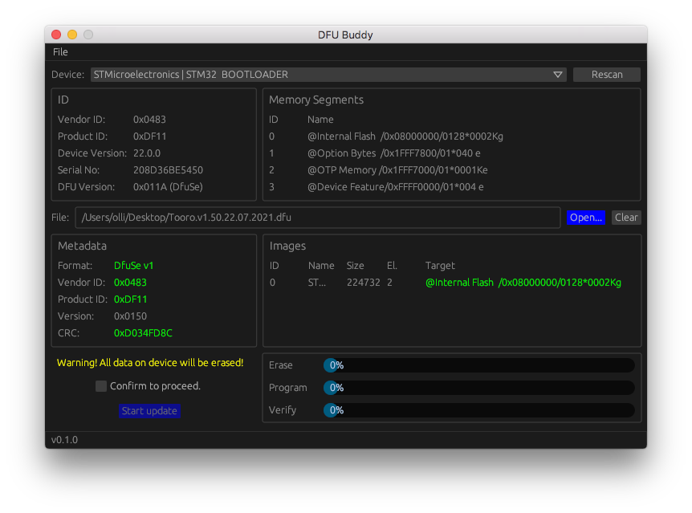

# DFU Buddy

## About

DFU Buddy is a cross-platform GUI utility for performing firmware upgrades on embedded devices via USB.

It is based on the DFU standard [USB Device Firmware Upgrade Specification, Revision 1.1](https://usb.org/sites/default/files/DFU_1.1.pdf), published by the [USB Implementers Forum](https://www.usb.org) and supports the DfuSe extensions by STMicroelectronics.

Operation is designed to be simple and straightforward for non-expert users. Therefore, a number of more advanced (and potentially dangerous) features are not provided. If you need these and you know what you're doing, use a tool like [dfu-util](http://dfu-util.sourceforge.net/).

## Status

DFU Buddy is still work in progress and lacking functionality. Also, some devices don't work yet. Support by other users, mainly in form of testing with USB devices is highly appreciated.

- Devices must be in DFU mode to appear in the selection menu.
- Plain DFU is not supported yet, only DfuSe devices like STM32.
- Only the internal flash of STM32 MCUs can be programmed, no OTP, no option bytes.
- Workarounds for specific non-compliant devices are not implemented.
- Tests were done using the following devices:
    - STM32L433VC internal bootloader: working
    - STM32G474VC internal bootloader: working
    - STM32F405RG (pyboard) internal bootloader: not working (overflow error).

## Building from Source

See [separate document](BUILDING.md) for detailed instructions.

## License

Published under the MIT license.

Author: Oliver Rockstedt <info@sourcebox.de>

## Donations

If you like to support my work, you can [buy me a coffee.](https://www.buymeacoffee.com/sourcebox)

